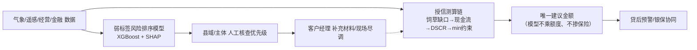

# 工银牧融答辩口径：弱标签风险排序

## 一、标签不平衡不是缺陷掩饰，而是真实世界约束

高原牧区的明确灾害、理赔和逾期事件本来就是低频事件；同时，县级公开报道、保险理赔和银行逾期数据的覆盖并不完整。因此，样本中“有来源支持事件”远少于全部县月是现实的数据形态，而不是可以用“未检索到报道”强行补成无灾的空白。

平台把没有来源凭证的月份明确保留为“未确认”，不将其当作真实无灾或真实负样本。这一做法宁可保留不确定性，也不制造虚假的全量标签。

## 二、模型评价以 MAE 为主

当前模型对连续风险分进行拟合与排序，主要评价指标使用 MAE（平均绝对误差），用于衡量预测风险分与规则弱标签之间的偏差；不把准确率包装成对真实灾害或违约的预测能力。

MAE 的定位是：检查风险分排序与既定弱标签规则的一致性，不是证明已经获得真实灾害发生概率或贷款违约概率。

## 三、128 条真实事件是监督边界，不是全量真值

当前已整理 128 条带来源凭证的公开灾害事件。它们用于：

- 对部分县月提供来源支持的风险边界；
- 给予训练时更高权重，增强事件月份的识别能力；
- 为人工核查提供可追溯证据。

它们不覆盖全部灾害、理赔或逾期事实，也不把未覆盖月份定义为无灾。

## 四、产品定位：风险排序工具，而非预测器

模型输出用于把县域/县月按风险线索排序，帮助客户经理决定人工核查的优先顺序；它不是：

- 灾害必然发生的预测结论；
- 贷款违约概率；
- 自动授信或自动拒贷依据。

最终授信金额由独立的授信测算链路结合资金需求、现金储备与标准雪灾情景偿债能力计算；模型风险排序只提供辅助核查线索。

## 建议现场表述

> 我们没有把“没找到公开报道”当成无灾，也没有把少量事件包装成全量真值。128 条有来源凭证的事件定义了监督边界，其他月份保持未确认。模型用 MAE 检查弱标签风险分的排序一致性，定位是客户经理的风险排序工具：先把值得人工核查的县月排在前面，而不是声称能预测灾害或给出违约概率。

## 五、事件月响应检验（2026-08-16）

- 检验方法：对 128 条带来源凭证的真实灾害事件，比较其模型预测分在同县全部月份中的百分位；未确认月份不参与负样本，只做县内相对比较。
- 结果（训练集内口径，含泄漏，作为"模型行为"证据）：事件月预测分县内百分位均值 0.811、93.8% 进入本县前 50%、70.3% 进入前 30%；事件月平均比同县其他月份高约 12 分；严重度高(76.8)>中(56.6)>低(39.4) 单调。
- 泛化参考（时间前向：训练≤2022-12，2023+ 共 41 条事件月模型未见）：百分位均值 0.636、分差 +3.3，方向一致但较弱。
- 口径：检验证明模型输出与真实事件月份显著关联，不证明因果或违约预测能力。

## 六、模型与授信链的关系（答辩必讲）

口径要点：
- 模型的价值 = 把 128 条真实事件月份显著排在前面（事件月预测分县内百分位 0.811，见第五节）+ 给客户经理核查优先级；模型**不进入金额计算**。
- 金额 = 纯计算链（饲草缺口→现金流→DSCR→min(融资需求, 雪灾偿债上限, 授信可用, 产品上限)），参数敏感性已标定（见《授信情景参数依据与敏感性分析.md》）。
- 为什么这样设计：避免"因灾放贷"与不可解释的重复扣减；生态风险只通过饲草缺口进入现金流一次。
